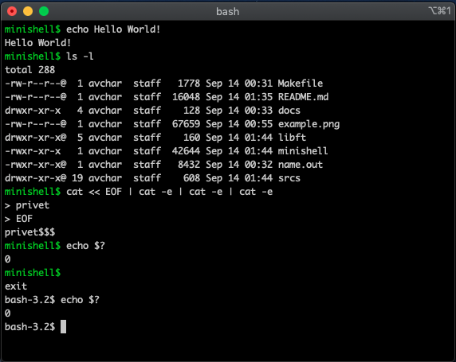
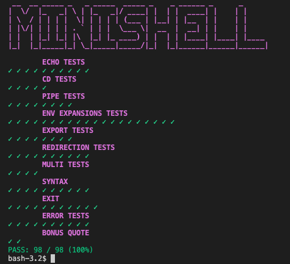

<h1>-Minishell-</h1>

[](https://github.com/JaeSeoKim/badge42)

<p>The objective of this project is for you to create a simple shell. Yes, your little bash or zsh. You will learn a lot about processes and file descriptors.</p>

### **You can find subject and check list [here](./docs)**

### This group project was written by [Avchar](https://github.com/Avchar) and [Zhunya-bz](https://github.com/Zhunya-bz)

## How to use: ##
```
to install readline:	make readline
to start project:		make re && ./minishell
to check norm:			make norm
```
If you have some problems with readline, install it on you PC and change PATH with library and include way in Makefile.

<h3><a href="#test">About test here</a></h3>

<h3>Example:</h3>


<h2>Введение</h2>

<p>Существование оболочек связано с самим существованием ИТ. В то время все программисты согласились, что общение с компьютером с помощью выровненных переключателей 1/0 вызывает серьезное раздражение. Вполне логично, что им пришла в голову идея общаться с компьютером с помощью интерактивных строк команд на языке, несколько близком к английскому. С помощью Minishell вы сможете совершить путешествие во времени и вернуться к проблемам, с которыми люди сталкивались, когда Windows еще не существовало.</p>


<h2>Общие указания</h2>
<ul>
	<li>Ваш проект должен быть написан в соответствии с нормами.  Если у вас есть бонусные файлы/функции, они будут включены в проверку нормы, и вы получите 0, если в них есть ошибка нормы.</li>
	<li>Ваши функции не должны завершаться неожиданно (segmentation fault, bus error, double free, etc), кроме неопределенного поведения.  Если это произойдет, ваш проект будет считаться неработоспособным и получит a0 во время оценки.</li>
	<li>Все выделенное пространство памяти кучи должно быть правильно освобождено, когда это необходимо. Утечки не допускаются.</li>
	<li>Если предмет требует этого, вы должны предоставить Makefile, который скомпилирует ваши исходные файлы до требуемого результата с флагами -Wall, -Wextra и -Werror, и ваш Makefile не должен перелинковываться.</li>
	<li>Ваш Makefile должен, по крайней мере, содержать правила $(NAME), all, clean, fclean и re.</li>
	<li>Для включения бонусов в ваш проект, вы должны включить в ваш Makefile правило bonus, которое добавит все различные заголовки, librairies или функции, которые запрещены в основной части проекта. Бонусы должны находиться в другом файле_bonus.{c/h}. Оценка обязательной и бонусной части производится отдельно.</li>
	<li>Если ваш проект позволяет использовать свою libft, вы должны скопировать ее исходники и связанный с ней Makefile в папку libft с ее связанным Makefile. Makefile вашего проекта должен компилировать библиотеку, используя ее Makefile, а затем компилировать проект.</li>
	<li>Мы призываем вас создавать тестовые программы для вашего проекта, даже если эта работа не будет сдаваться и не будет оцениваться. Это даст вам возможность легко проверить свою работу и работу ваших коллег. Эти тесты будут особенно полезны во время защиты. Действительно, во время защиты вы можете использовать свои тесты и/или тесты коллеги, которого вы оцениваете.</li>
	<li>Отправьте свою работу в назначенный вам git-репозиторий. Оцениваться будет только та работа, которая находится в git-репозитории. Если Deepthought назначит оценку вашей работы, это будет сделано после того, как вы оцените работу сверстника. Если во время оценивания Deepthought в любом разделе вашей работы будет допущена ошибка, оценка будет остановлена.</li>
</ul>

<h2>Обязательная часть</h2>

<h3>Ваша оболочка должна:</h3>
<ul>
	<li>Не интерпретировать незакрытые кавычки или неопределенные специальные символы типа \ or ; .</li>
	<li>Не использовать более одной глобальной переменной, думать об этом и быть готовым объяснить, почему вы это делаете.</li>
	<li>Показывать подсказку при ожидании новой команды.</li>
	<li>Иметь рабочую Историю.</li>
	<li>Искать и запускать нужный исполняемый файл (на основе переменной PATH или используя относительный или абсолютный путь).</li>
	<li>Он должен реализовывать встроенные модули:
	<ul>
		<li>echo с опцией -n</li>
		<li>cd только с относительным или абсолютным путем</li>
		<li>pwd без опций</li>
		<li>export без опций</li>
		<li>unset без опций</li>
		<li>env без опций и аргументов</li>
		<li>exit без опций</li>
	</ul>
	</li>
	<li>' запретить любую интерпретацию последовательности символов.</li>
	<li>" запретить любую интерпретацию последовательности символов, кроме $.</li>
	<li>Перенаправления:
	<ul>
		<li>"<" должен перенаправлять ввод.</li>
		<li>">" перенаправляет вывод.</li>
		<li>"<<" считывает ввод из текущего источника до тех пор, пока не появится строка, содержащая только ограничитель. ему не нужно обновлять историю!</li>
		<li>">>" должен перенаправлять вывод в режиме append.</li>
	</ul>
	</li>
	<li>Pipes | Выход каждой команды в конвейере соединяется с помощью pipe с входом следующей команды.</li>
	<li>Переменные окружения ($, за которыми следуют символы) должны расширяться до своих значений.</li>
	<li>$? должно расширяться до состояния выхода последнего выполненного конвейера переднего плана.</li>
	<li>ctrl-C ctrl-D ctrl-\ должны работать как в bash.</li>
	<li>В интерактивном режиме:
	<ul>
		<li>ctrl-C печатать новый запрос на новой строке.</li>
		<li>ctrl-D выйти из оболочки.</li>
		<li>ctrl-\ ничего не делает.</li>
	</ul>
	</li>
</ul>
<p>Функция Readline может создавать некоторые утечки, которые не нужно исправлять. Но будьте внимательны, ваш собственный код не должен создавать утечек. Вы должны ограничиться описанием темы. Все, что не задано, не является обязательным. Для каждого пункта, если у вас есть сомнения, возьмите bash в качестве справочника.</p>

<h2>Бонусная часть</h2>
<ul>
    <li>Если обязательная часть не идеальна, даже не думайте о бонусах.</li>
    <li>&& , || со скобками для приоритетов.
	<ul>
		<li>&& - будет выполнять вторую команду только в том случае, если первая команда выполнена успешно</li>
		<li>|| - оператор позволяет вам выполнять вторую команду только в случае сбоя при выполнении первой команды</li>
		<li>; - позволяет запускать несколько команд за один раз, и выполнение команды происходит последовательно.</li>
	</ul>
	</li>
    <li>Подстановочный знак * должен работать для текущего рабочего каталога.</li>
</ul>

<h3>You are allowed to use the following functions:</h3>

<ul>
	<li><a href="http://manpages.org/readline/3">-- readline -- (типо gnl !!!нужно фришить!!! #include stdio.h)</a></li>
	<li><a href="http://ru.manpages.org/fork/2">-- fork -- (создает дочерний процесс #include unistd.h)</a></li>
	<li><a href="http://ru.manpages.org/waitpid/2">-- wait / waitpid -- (ожидает завершения процесса  #include sys/wait.h)</a></li>
	<li><a href="http://ru.manpages.org/wait3/2">-- wait3 -- (ожидает смену состояния в стиле BSD #include sys/wait.h)</a></li>
	<li><a href="http://ru.manpages.org/wait4/2">-- wait4 -- (ожидает смену состояния в стиле BSD #include sys/wait.h)</a></li>
	<li><a href="http://ru.manpages.org/signal/2">-- signal -- (работа с сигналами #include signal.h)</a></li>
	<li><a href="https://www.opennet.ru/man.shtml?topic=kill&category=3&russian=5">-- kill -- (send a signal to a process or a group of processes #include signal.h)</a></li>
	<li><a href="http://ru.manpages.org/getcwd/3">-- getcwd -- (возвращают текущий рабочий каталог #include unistd.h)</a></li>
	<li><a href="http://ru.manpages.org/chdir/2">-- chdir -- (изменить рабочий каталог #include unistd.h)</a></li>
	<li><a href="http://ru.manpages.org/stat/2">-- stat / lstat / fstat -- (считывает состояние файла #include unistd.h)</a></li>
	<li><a href="https://www.opennet.ru/man.shtml?topic=unlink&russian=0&category=&submit=%F0%CF%CB%C1%DA%C1%D4%D8+man">-- unlink -- (удаляет указанный файл #include unistd.h)</a></li>
	<li><a href="https://www.opennet.ru/man.shtml?topic=execve&russian=0&category=&submit=%F0%CF%CB%C1%DA%C1%D4%D8+man">-- execve -- (выполнить программу #include unistd.h)</a></li>
	<li><a href="https://www.opennet.ru/man.shtml?topic=dup&russian=0&category=&submit=%F0%CF%CB%C1%DA%C1%D4%D8+man">-- dup / dup2 -- (создать дубликат файлового дескриптора #include unistd.h)</a></li>
	<li><a href="https://www.opennet.ru/man.shtml?topic=pipe&category=2&russian=0">-- pipe -- (создает канал #include unistd.h)</a></li>
	<li><a href="http://ru.manpages.org/opendir/3">-- opendir -- (открывает каталог #include dirent.h)</a></li>
	<li><a href="http://ru.manpages.org/readdir/3">-- readdir -- (чтение содержимого каталога #include dirent.h)</a></li>
	<li><a href="http://ru.manpages.org/closedir/3">-- closedir -- (закрыть каталог #include dirent.h)</a></li>
	<li><a href="http://ru.manpages.org/isatty/3">-- isatty -- (проверяет, указывает ли файловый дескриптор на терминал #include <unistd.h>)</a></li>
	<li><a href="http://ru.manpages.org/ttyname/3">-- ttyname -- (возвращает имя терминала #include unistd.h)</a></li>
	<li><a href="http://ru.manpages.org/ttyslot/3">-- ttyslot -- (поиск слота текущего терминала пользователя в определённом файле #include unistd.h)</a></li>
	<li><a href="http://ru.manpages.org/ioctl/2">-- ioctl -- (управляет устройством  #include sys/ioctl.h)</a></li>
	<li><a href="http://ru.manpages.org/getenv/3">-- getenv -- (возвращают значения переменной окружения #include stdlib.h)</a></li>
	<li><a href="http://manpages.org/tcsetattr#synopsis">-- tcsetattr -- (установить параметры, связанные с терминалом  #include termios.h)</a></li>
	<li><a href="http://manpages.org/tcgetattr">-- tcgetattr -- (получить параметры, связанные с терминалом #include termios.h)</a></li>
	<li><a href="http://manpages.org/tgetflag/3">-- tgetent / tgetflag / tgetnum / tgetstr / tgoto / tputs -- (#include curses.h #include term.h)</a></li>
	<li><a href="https://www.opennet.ru/man.shtml?topic=strerror&russian=0&category=&submit=%F0%CF%CB%C1%DA%C1%D4%D8+man">-- strerror -- (возвращают строку, описывающую ошибку #include string.h)</a></li>
	<li><a href="http://ru.manpages.org/errno/3">-- errno -- (код последней ошибки #include errno.h)</a></li>
	<li><a href="https://www.opennet.ru/man.shtml?topic=printf&russian=0&category=&submit=%F0%CF%CB%C1%DA%C1%D4%D8+man">-- printf -- (#include stdio.h)</a></li>
	<li><a href="https://www.opennet.ru/man.shtml?topic=malloc&russian=0&category=&submit=%F0%CF%CB%C1%DA%C1%D4%D8+man">-- malloc --</a></li>
	<li><a href="http://www.c-cpp.ru/content/free">-- free --</a></li>
	<li><a href="https://www.opennet.ru/man.shtml?topic=write&russian=0&category=&submit=%F0%CF%CB%C1%DA%C1%D4%D8+man">-- write --</a></li>
	<li><a href="http://ru.manpages.org/open/2">-- open -- (открывае/создает файл  #include fcntl.h)</a></li>
	<li><a href="http://ru.manpages.org/read/2">-- read -- (читает из файловго дескриптора #include unistd.h)</a></li>
	<li><a href="http://ru.manpages.org/close/2">-- close -- (закрывает файловый дескриптор #include unistd.h)</a></li>
	<li><a href="https://www.opennet.ru/man.shtml?topic=exit&russian=0&category=&submit=%F0%CF%CB%C1%DA%C1%D4%D8+man">-- exit -- (функция, завершающая работу программы #include unistd.h)</a></li>
	<li>rl_clear_history</li>
	<li>rl_on_new_line</li>
	<li>rl_replace_line</li>
	<li>rl_redisplay</li>
	<li>add_history</li>
</ul>

<h1 id="test">TESTER</h1>

## Requirements

- You must have your prompt and any other message/banner printed on ``STDERR`` (like bash)

## Usage

* Run: ``make test``, or for  specific test: ``bash test.sh [echo exit pipe etc..]``

<h3>Example:</h3>


## What does it test ?

- ``echo``
- ``cd + pwd``
- ``exit``
- ``pipe |``
- ``redirect > >> < ``
- ``export``
- ``env``
- ``unset``
- ``exit status ($?)``
- ``syntax errors``
- ``quote (bonus)``
- ``oper (bonus) $$ || ()``
- ``wildcard (bonus)``

## What should you test by yourself ?

Almost everything :) This tester is not perfect and is not checking ``leaks``, ``heredoc`` and ``error messages``.<br>
Some tests'l be show another error codes.
Also it not good for checking projects with termcaps.

### For macOS
<p>instal brew: curl -fsSL https://rawgit.com/kube/42homebrew/master/install.sh | zsh</p>

<p>HOME macOS:</p>
<ul>
    <li>-L/usr/local/opt/readline/lib</li>
    <li>-I/usr/local/opt/readline/include</li>
</ul>

<p>school21 macOS:</p>
<ul>
    <li>-L/Users/${USER}/.brew/opt/readline/lib</li>
    <li>-I/Users/${USER}/.brew/opt/readline/include</li>
</ul>

```
	i = 0;
	t_data *data = cmd->data;
	while (data->fd_pipes[i])
	{
		printf("fd[%d][0] = %d\tfd[%d][1] = %d\n", i, data->fd_pipes[i][0], i, data->fd_pipes[i][1]);
		i++;
	}
```
